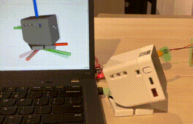

# rostack-chan（ﾛｽﾀｯｸﾁｬﾝ）

ROS2で構成したｽﾀｯｸﾁｬﾝ（ﾛｽﾀｯｸﾁｬﾝ）です。



## 必要なもの

### ソフトウェア

- ROS 2 Humble (Ubuntu 22.04)
- [feetech_scs_ros2_driver](https://github.com/Ar-Ray-code/feetech_scs_ros2_driver)
- （表情の変化）： Docker

### ハードウェア

- FeeTech SCS0009 (ID: 0, 1, baudrate: 1000000)
- M5Stack CORE2

## ビルド

### M5Stackへの書き込み

[PlatformIO](https://platformio.org/install)を起動して、 [face](./face/)をM5Stackに書き込みます。

- 内部でM5Unifiedを使用していますが、micro-ROSの関係上、S3・C3系のビルドが通らない可能性があります。
- [ip_template.hpp](./face/src/ip_template.hpp)をもとに `ip.hpp` を作成してWi-Fi(2.4GHz)への接続先を設定してください。
- `IP_ADDRESS`は接続先のコンピュータのIPアドレスを設定してください。
- `ROS_DOMAIN_ID`は0固定です。（何も設定していない場合の `ROS_DOMAIN_ID` は0です）

<br>

### コンピュータ側の準備

Dockerと`ros-humble-desktop`をインストールした上で、[package.xml](./rostackchan_description/package.xml)を満たす依存関係をインストールします。

```bash
sudo apt install -y \
    ros-humble-ros2-control* \
    ros-humble-control-msgs \
    ros-humble-xacro
```

次に、aptでインストールできないパッケージをインストールします。

```bash
mkdir -p ~/ws_rostackchan/src
cd ~/ws_rostackchan/src

git clone https://github.com/HarvestX/h6x_serial_interface.git -b humble
git clone https://github.com/Ar-Ray-code/feetech_scs_ros2_driver.git -b main
git clone https://github.com/Ar-Ray-code/rostack-chan.git -b main
```

`~/ws_rostackchan`内のパッケージをビルドします。


```bash
cd ~/ws_rostackchan
source /opt/ros/humble/setup.bash
colcon build
```

<br>

## 実行

ｽﾀｯｸﾁｬﾝに5Vを供給してサーボモータをPCに接続します。

その上で、以下のコマンドを実行します。

### Terminal1：(micro-ROS使用時)

```bash
docker run -it --rm --net=host microros/micro-ros-agent:humble udp4 --port 2000
```

### Terminal2

```bash
source ~/ws_rostackchan/install/setup.bash
ros2 launch rostackchan_example rostackchan_random.launch.py
```

## dpkg

- [Humble](https://s3.ap-northeast-1.wasabisys.com/download-raw/dpkg/ros2-desktop/debian/bullseye/ros-humble-desktop-rostackchan-full-0.3.2_20230825_arm64.deb)
- [Iron](https://s3.ap-northeast-1.wasabisys.com/download-raw/dpkg/ros2-desktop/debian/bullseye/ros-iron-desktop-rostackchan-full-0.3.2_20230825_arm64.deb)

## reference

- https://github.com/meganetaaan/stack-chan
- https://github.com/dynamixel-community/dynamixel_hardware_examples
- https://github.com/Ar-Ray-code/feetech_scs_ros2_driver
- https://github.com/NITKK-ROS-Team/micro_ros_arduino_simpler
